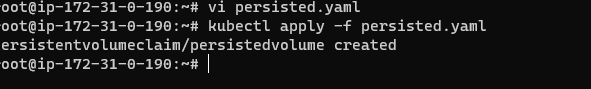
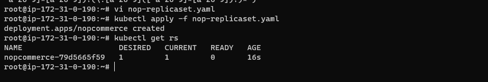

* (1) Create a MySQL pod with Stateful Set with 1 replica

        first we create persisted volume

    these persisted volume attached mysql database by using name tag
    

 * (2) Create a nopCommerce deployment with 1 replica

---
apiVersion: apps/v1
kind: Deployment
metadata: 
  name: 'nopcommerce'
  labels:
    name: web
spec:
  minReadySeconds: 3
  progressDeadlineSeconds: 10
  replicas: 1
  selector:
    matchLabels:
      app: web
  template:
    metadata: 
      name: 'noppod'
      labels:
        app: web
    spec:
      containers:
        - name: nopcommerce
          image: hema789/hello:nop-2.0
          ports:
            - containerPort: 5000
              protocol: TCP

 

