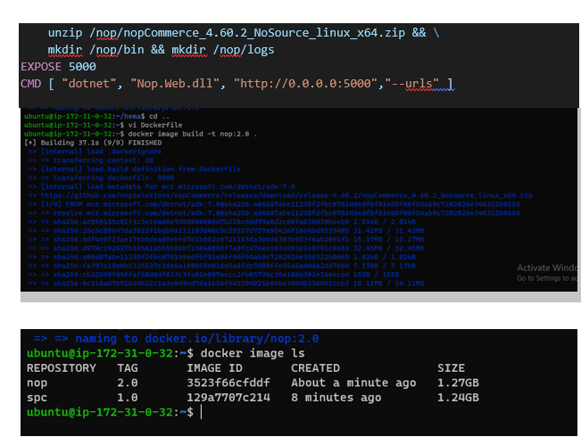
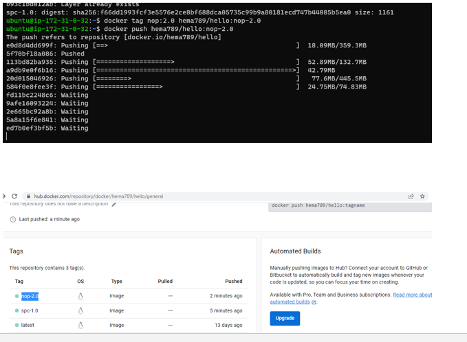
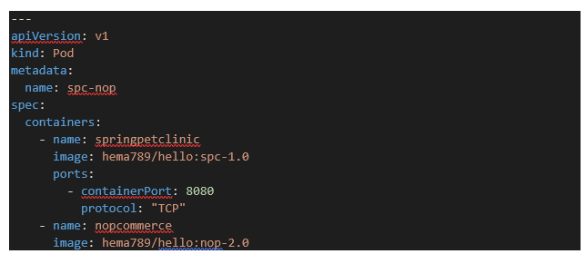
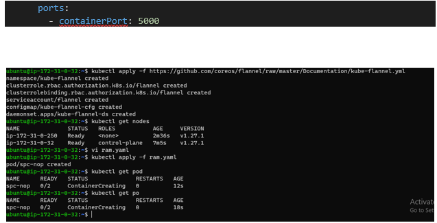

TASK:1) Create pod with two container             a) springpetclinic                                         b) nop Commerce

First  we create 2 t2.large  instances
In master and nod we install kubeadm,kubectl,docker and go language
First we write docker files for spc & nop
Build images
Push to docker hub
After we write yaml file for creating pods
Kubectl apply -f <yaml file name> 

----

