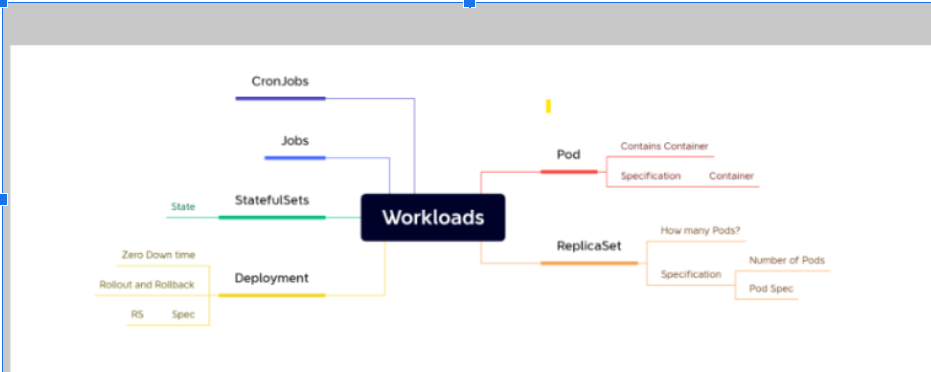
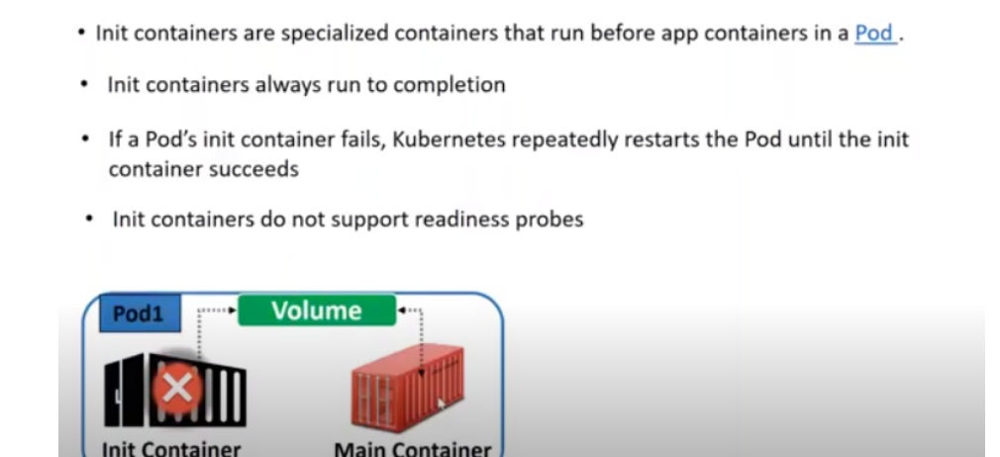
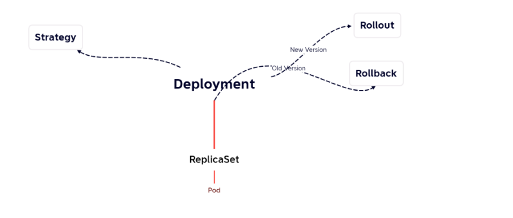
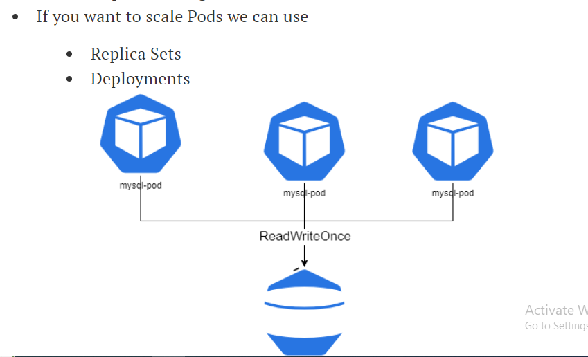
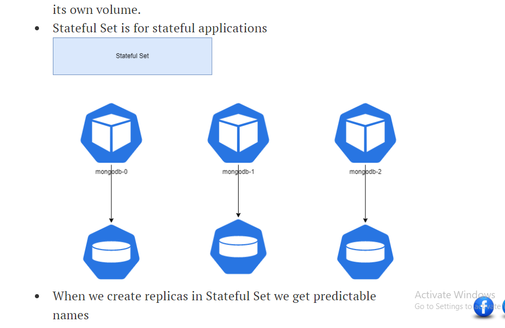
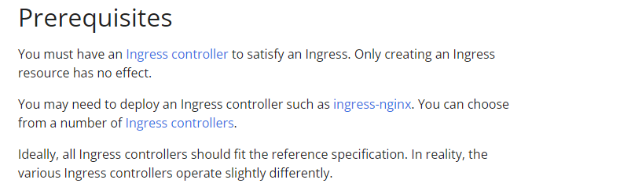
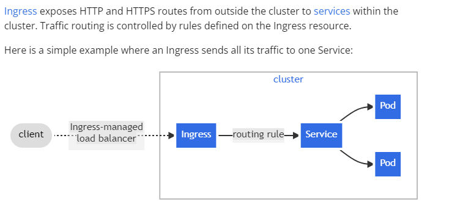
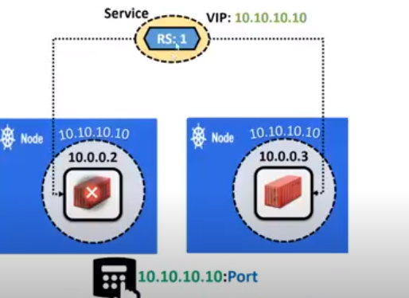
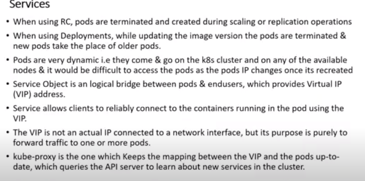

KUBERNETES: it have 8 charectores  between k and s

* Need of k8s
    * High availability: some applications will go down k8s try to restart the containers 
    * Autoscalling: containers don’t scale on there own
 	    Horizontal: increase the no. of containers

	    Vertical: increase the size of container
        
    * Zero down time deployment:
        roolout:new version
        roolback:old version
        we have any bugs in new version we went to choose old version(for example we take ubuntu 20.04 sor the installation of azuredevops agent)
* DISTRIBUTED SYSTEM: multiple machines can work (master node , node )
* CLUSTER: combination of multiple machines but it speaks or looks like one machine(that is master server)
* STATE: storage
* STATEFULL: store your application in your local s/m
* STATELESS:it can be stored in external (storing in db)
* MONOLITH: running hole application in one server
* MICRO SERVICES: we splite the huge application into simple steps
* DESIRED STATE:
    1) declarative: docker file (or)docker-compose.yaml 
    2) imperative:using command lines (it is not a correct approach)
* In kubernetes we don't have pets mind set(means cannot connect emotionally for special treatment of healthcheck) . we have cattle mindset (means one of the cow will be sick its replaced by other one )
* kubernetes is not only desired  for docker 
* MASTERNODE:
    1)kubeAPI: all the communications (internal/external)in k8s will done by kubeAPI  server . It exposes funtionally over HTTP(S)protocol& provide REST API
        kube api can understand only json & http languages , manifest yaml files understand by kubeapi we use "kubeconfig"
    2) Etcd: it has own life ; any thing stored in k8s cluster we need etcd. all k8s stored in etcd(defalut & non-default): cluster crash ayipotea backup cheayalsina componet etcd.
    3) SHEDULER: in k8s we want to create  something new node(object) by using of scheduler.(its responsible for maintaining desired state)
     sheduler communicate with API  and API communicate with node 
     sheduler----API---node
     4)CONTROLLER: controller manager is responsible for maintaining desired state.(changes jarigite contrller manageer check cheasi matramea controller daniki saripade size ni batti node ni choose cheastumdhi) 
        (this recognation loop that checks for desired state . to did assigned work to scheduler by controller)
WORKER NODE: 
    1) kubelet: control plan is assigned any work that work will be done by kubelet(agent)(to pass information from worker node to master node)
    2) conntainer runtime: container technology to be used in k8s cluster(Docker , docker support, ....)
    3) kube-proxy: this component is responsible for networking for containers on the node.
    container network interface pluggins:(ex: planner, calico, wave unit)
   
    CLOUD CONTROLE MANAGEMENT
* EKS:elastic kubernetes service
* AKS:azure kubernetes service
* GKE: google kubernetes engine

* CONTROL PLAN: example:how do you run 4 components is our choise
* MASTER: example:all of 4 components are placed in master plan
* KUBELET: its sends status will be send to after finishing work of kubectl what ever work assigned by controlplane
* CONTAINER RUNTIME: container technology to be used in k8s cluster
* KUBE_PROXY: this component is responsible for networking of containers on the node
* KUBE CTL CONFIG: which contains api-server information, kubectl allows to communication with cluster to create resources.
* for high availability cluster we choose only odd no. of services
* kubeadm: the command to bootstrap the cluster.

kubelet: the component that runs on all of the machines in your cluster and does things like starting pods and containers.

kubectl: the command line util to talk to your cluster.

* k8s object: every thing in k8s is an object
* CATALOG: list of all the requests(menu) 
* PODS: k8s creates smallest unit is called pod
    pod is automatic unit of creation of k8s
    every pod have specific ip adress(not for container)
    docker containers placed inside the pod
    pods speaks creating base job
* CRON JOB: sheduling base job
* JOB:somthing runs in one time, a job does not deleted by itself , we have to delete it.
        vi job.yaml
        kubectl apply -f job.yaml
        kubectl delete -f job.yaml
        
* SCALLING: to create no.of pods, scalling in k8s is ncreases no.of pods not containers.  pods can assigned to node
* containers go down k8s trying to restartthe containers .
* OCI:  Open container Initiative work is  stores the function's logs in Oracle Cloud Infrastructure (or in an external logging destination. When the function has finished executing and after a period being idle, the Docker container )
* SHIM: create containers periodically interface b/w docker to kubernetes

* PODS LIFE CYCLE:
    1)pending: "once your container connected to your pods it takes some time "
    2) running:
    3) succeed: " finished/complete the exeution"
    4)failed: "one container in the pod was terminated means stop"
    5) unknown:"error state(no communications between two containers)

* CONTAINER STATES IN K8S PODS: 
    1) waiting:
    2) running:
    3) terminated
* CONTAINER RESTART POLICY:
    restartpolicy:onfailure(error code never restarted only success code is restarted we take two different codes)
    restartpolicy:never(after complte the state k8s cannot try to restart the container )
    restartpolicy:always(default)(container always restarts when desired state will be compleated)

    * INSTALL KUBERNETIES:
    IN MASTER AND NODE

    * # Run these commands as root
###Install GO###
> wget https://storage.googleapis.com/golang/getgo/installer_linux

chmod +x ./installer_linux

./installer_linux

source ~/.bash_profile

> git clone https://github.com/Mirantis/cri-dockerd.git

>cd cri-dockerd

> mkdir bin

> go build -o bin/cri-dockerd

> mkdir -p /usr/local/bin

> install -o root -g root -m 0755 bin/cri-dockerd /usr/local/bin/cri-dockerd

> cp -a packaging/systemd/* /etc/systemd/system

> sed -i -e 's,/usr/bin/cri-dockerd,/usr/local/bin/cri-dockerd,' /etc/systemd/system/cri-docker.service

> systemctl daemon-reload

> systemctl enable cri-docker.service

> systemctl enable --now cri-docker.socket

> sudo apt-get update

> sudo apt-get install -y apt-transport-https ca-certificates curl

> sudo curl -fsSLo /etc/apt/keyrings/kubernetes-archive-keyring.gpg https://packages.cloud.google.com/apt/doc/apt-key.gpg

> echo "deb [signed-by=/etc/apt/keyrings/kubernetes-archive-keyring.gpg] https://apt.kubernetes.io/ kubernetes-xenial main" | sudo tee /etc/apt/sources.list.d/kubernetes.list

> sudo apt-get update

> sudo apt-get install -y kubelet kubeadm kubectl

> sudo apt-mark hold kubelet kubeadm kubectl
>  

* CRONJOB: job starts every one hour or week or month we use cronjob
* in spec we have controllers .
  in controllers we have cronjobs
  in cronjob we have jobs(templete)
  in job we have pods
  in pods we have containers
* controller basically maintaines to another k8s resources
* BACKOFFLIMIT: job have back of limit to limit number of restarts and active dead line seconds to limit time period of execution.

* we can delete the job (contrller)  then pods(child objects) also deleted
* pods dosnot maintain any state .
* now if we want to access the application in container we can doport - forword (not in the container)
    kubectl port-forword <application name> 
* we can't port forward the application inside the container. (kubectl port-forword --address "0.0.0.0"<pod name>8080:80)
  kubectl not recommended because it's does not a client approch . it's only in my local laptop its application works,
  thats way we cannot recomended this application

* pod is a smallest component in the k8s . so it's a workload not a controller

* job is a controller because it controles another k8s job

* cronjob is a contoller becacuse it controlles another k8s job

*  HEALTH CHECKS/PROBES:  
 1: LIVENESS PROBE:   this checks fails k8s restart the container
 2: READINESS PROBE: when rediness probe is passed to service  the forword request passsed to pod , it fails the pod will be removed from pods
 3: STARTUP PROBES: every thing in your application is starts
* (probes) or checks can be performed on applications are running or not inside the container we check by using probes.

EXEC: when my application is not good how to restart the container(run any linux/windows command which returns status exit code)
  http: 1 -information 
        2- success
        3- restart
        4- somthing which not present
  GRPC: grpc is also one of the  communication mechanisom

  ---------------------

PODS WIth SPECIFIC reSOURCES: (cpu/memory)
 resources are two types  
1) requests: manimum memory utilization(ex: memory:64Mi , cpu: 250m)
2) limits:maximum memory utilizatin ( ex: memory: 256Mi ,  cpu: 1000m)

container: containers are threetypes 

1)normal container:

2) init container: init containers are containers job cannot run continuously , if one container will be down then init container works
till actual containers will up then init  containers will stop work.
----

3)ephemeral container: 

SCALLING: scallings are three types 
    1) horizontal scalling: depends on workload  then number of pods  increasing/decreasing
    2) vertical scalling: depends on workload size of the podm will be increases or decreases
    3) node scalling: kubeadm join

 
 * CONTROLLER:

  

 deployment: deployment depends on two objects
    1) roolout: goto latest version(kubectl roolout --help)
        a) deployment
        b) deamon sets
        c) stateful sets
                in statefull applications store data locally . in containers the data  created locally will be lost once you delete it . so to solve this is docker we have used volumes , volumes have a lifecycle which has no relations to container ifecycle (refer volumes , image layers, containers)
                
                VOLUMES: 
                once you delete pod volume also deleted
                to store the data is called volue
                volumes are three types
                1) storage on cloud (ebs, azuredisk, efs , azure life & gcr)
                2) empty directory
                3) host path
 
 statefulset: each  pod have it's own volume is called k8s cluster . it's more predictable names
 we can access individual pod by creating headless service 

 HEADLESS SERVICE: service don't have ip address , it's runs name and name space
 SYNTAX: <podname>.<service name>.<namespace>
 
 name space: name space is used  to create verctual (isolated) space for every  pods 

 
                SHAD:  one process break into multiple functionality records is called shad.
 

                persisted volume is a live where your volume is dead
                CSI: controller storage volme(max. companies follws to storage)
                SSD: standers storage disks will not concurrensive but nod is acts concurrences

    2) undoroolout(roolback): when bugs occure in present version goto previous version

storage: 
    recreating: delete pod its replaced by default it takes desired state (no. of pods) we increase pods it will start newer version .recreate don't have downtime . its not create one by one its create all pods at a time by using storage percentage.

ANNOTATIONS: change-cause (is not a funtionality it's manage data)
    change deployment >>> change annotatins
        +
        every time you get a new version 
        +
        don't chage image we change only tag

DEAMONSET(ds): it's a  Controller which creates pod on every selected nodes in kubernetes cluster
    1) log collector 
    2) agents
    node will be deleted pods also deleted

NODE-SELECTOR: spec>> node name >> node selector( for this approch is not good approch, we always prefer label approch)
>> we pods apply on nodes then we shedule depends on senarios 
    a) node effinity
    b) pod effinity

SERVICE: 

