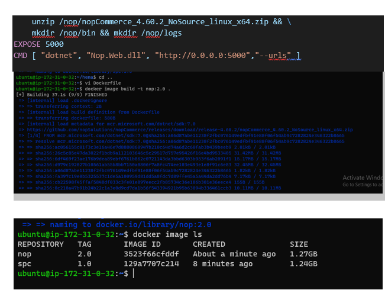
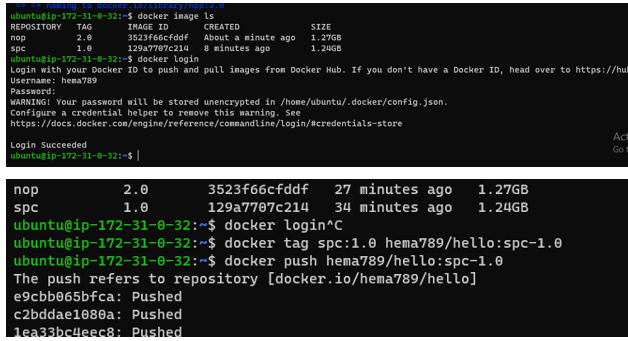
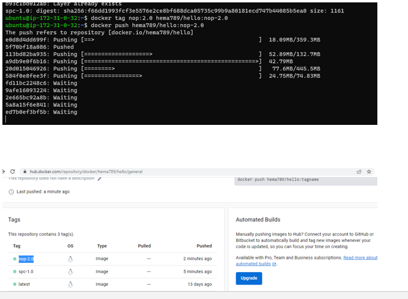
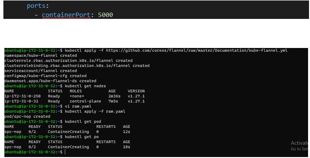
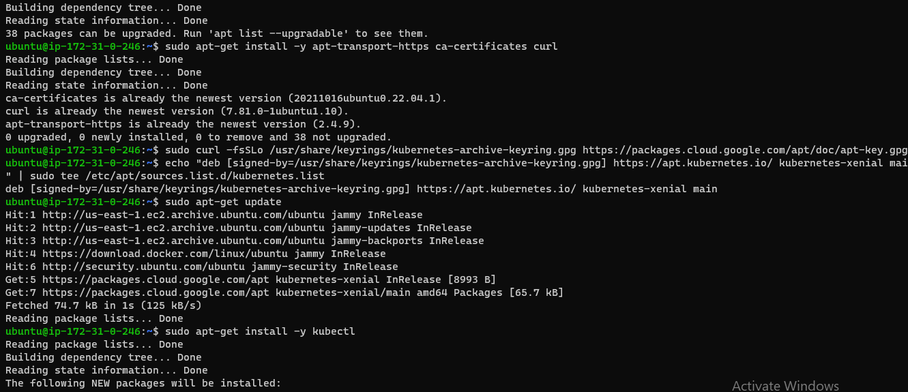
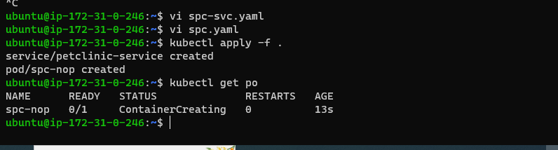

TASK:1) Create pod with two container             a) springpetclinic                                         b) nop Commerce

First  we create 2 t2.large  instances
In master and nod we install kubeadm,kubectl,docker and go language
First we write docker files for spc & nop
Build images
Push to docker hub
After we write yaml file for creating pods
Kubectl apply -f <yaml file name> 

----

TASK:2)   1) Explain Kubernetes architecture

The main components of a Kubernetes cluster include

    1)Nodes:  Nodes are VMs or physical servers that host containerized applications. Each node in a cluster can run one or more application instance. There can be as few as one node, however, a typical Kubernetes cluster will have several nodes (and deployments with hundreds or more nodes are not uncommon).
       A) MASTERNODE:
        1)kubeAPI: all the communications (internal/external)in k8sn will done by kubeAPI  server . It exposes funtionally over HTTP(S)protocol& provide REST API
        kube api can understand only json & http languafes , manifest yaml files understand by kubeapi we use "kubeconfig"
         2) Etcd: it has own life ; any stored in k8s cluster we need etcd. all k8s stored in etcd(defalut & non-default)
         3) SHEDULER: in k8s we want to create  something new node by using of scheduler.(its responsible for maintaining desired state)
     sheduler communicate with API  and API communicate with node
     sheduler----API---node
         4)CONTROLLER: controller manager is responsible for maintaining desired state.
        (this recognation loop that checks for desired state . to did assigned work to scheduler by controller)
     
     B) NODE:

      NODE:
         1) kubelet: control plan is assigned any work that work will be done by kubelet
         2) conntainer runtime: container technology to be used in k8s cluster.
         3) kube-proxy: this component is responsible for networking for containers on the node.

    2)Image Registry: Container images are kept in the registry and transferred to nodes by the control plane for execution in container pods.
    3)Pods: Pods are where containerized applications run. They can include one or more containers and are the smallest unit of deployment for applications in a Kubernetes cluster.

   2) Setup k8s on single node using minikube and kind

   3) Run the Spring Pet Clinic
   
   * first we create one t2.small instance
   * install docker and do user modifications from ubuntu to docker
   * install kubectl and kubemini by using below link and 
   https://minikube.sigs.k8s.io/docs/start/

   install kube kind  using below [Reference]
   https://kind.sigs.k8s.io/
create one service.yaml file and one  springpetcinic.yaml file

